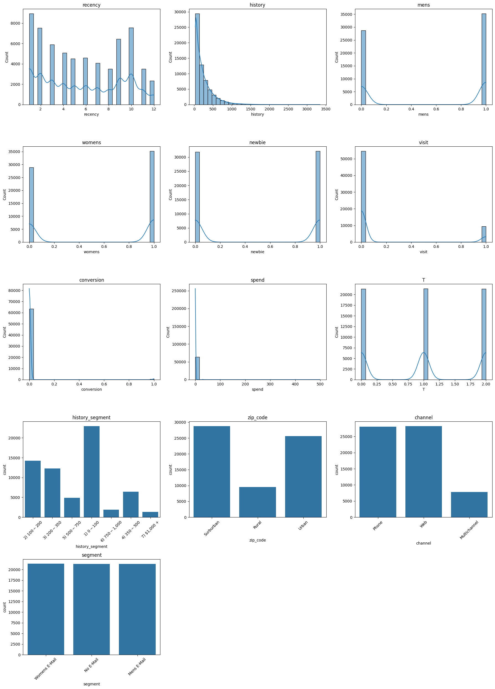
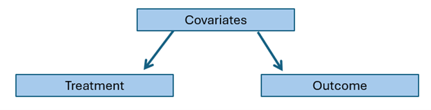
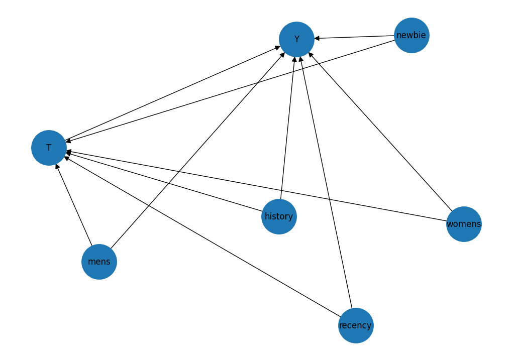
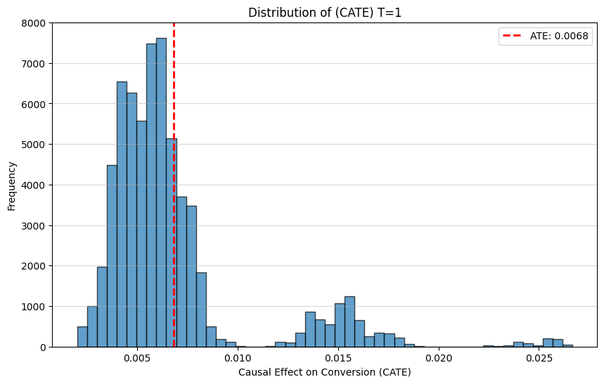
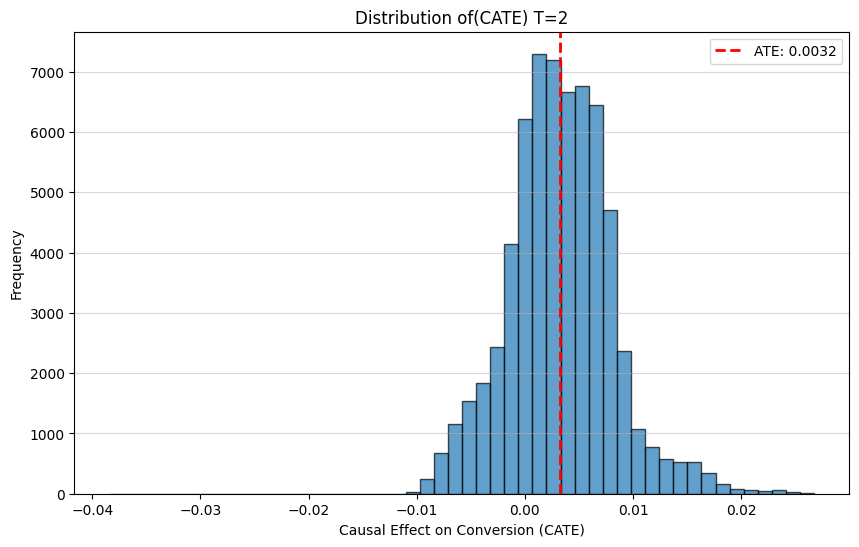
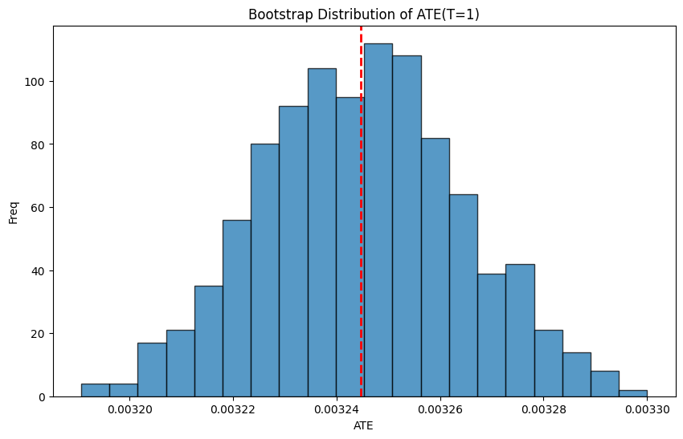
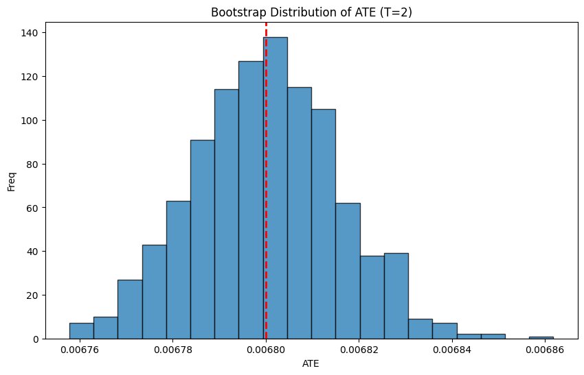

# causal-inference

### 1. Introduction

Image the following scenario: A company randomly sent out different types of promotional emails to customers. Through A/B testing, they concluded that sending the email increased sales. But, can they be sure customers made the purchase only because of the email? Will they get the same results in the future?

This is why causal inference is important. By looking at causal effect of sending the email on purchase sales, the company can find out whether the sales went up from sending the email only.

### 2. Dataset

This dataset is the famous marketing experiment from Kevin Hillstrom. It is commonly called the "Mine That Data Email Analytics Challenge" from 2008.

| |recency	|history_segment	|history|	mens	|womens|	zip_code|	newbie	|channel|	segment	|visit|	conversion|	spend|
|---| --- | --- | --- | --- | --- | --- | --- | --- | --- | --- | --- | --- |
|0	|10	|2)  100− 200|	142.44	|1|	0	|Surburban|	0|	Phone|	Womens E-Mail|	0|	0	|0.0|
|1|	6	|3)  200−350|	329.08	|1|	1|	Rural	|1	|Web|	No E-Mail|	0	|0	|0.0|
|2|	7	|2)  100−200	|180.65|	0	|1|	Surburban|	1|	Web	|Womens E-Mail	|0	|0|	0.0|
|3	|9|	5)  500−750	|675.83|	1|	0|	Rural	|1|	Web	|Mens E-Mail	|0|	0	|0.0|
|...	|...|	...|...|	...|	...|	...|...|	...	|...	|...|	...	|...|
|6400	|2|	1)  0−100	|45.34|	1|	0|	Urban|	0|	Web	|Womens E-Mail	|0|	0	|0.0|

The columns include following features: recency (how recently they purchased), history (how much they spent before), whether they previously bought men’s or women’s items, their zip code type, whether they are new customers, which marketing channel they use, which email segment they were assigned to, whether they visited the site, whether they converted, and how much they spent. 

The "segment" feature is what we are looking for, we want to see if it is a cause to increase in spending/conversion.

### 3. Validate dataset

Before doing anything with the dataset, we have to make sure that it is valid data. We can do this by looking at the histograms, to try and see if the are any weird datapoints, or outliers.



We should also check information about the dataset, to remove any null values from the dataset.

||	recency	|history_segment|	history|	mens	|womens	|zip_code|	newbie|	channel|	segment|	visit	|conversion|	spend|
|---|---|---|---|---|---|---|---|---|---|---|---|---|
|count|	64000.000000	|64000	|64000.000000	|64000.000000	|64000.000000	|64000	|64000.000000|	64000|	64000|	64000.000000|	64000.000000	|64000.000000
unique|	NaN|	7	|NaN	|NaN|	NaN	|3|	NaN|	3|	3|	NaN	|NaN|	NaN
top|	NaN|	1)  0− 100	|NaN	|NaN|	NaN	|Surburban|	NaN	|Web|	Womens E-Mail|	NaN|	NaN|	NaN
freq|	NaN	|22970|	NaN	|NaN|	NaN	|28776|	NaN	|28217|	21387	|NaN|	NaN|	NaN
mean|	5.763734|	NaN	|242.085656|	0.551031|	0.549719	|NaN	|0.502250	|NaN|	NaN	|0.146781	|0.009031|	1.050908
std	|3.507592|	NaN|	256.158608	|0.497393	|0.497526	|NaN|	0.499999	|NaN	|NaN	|0.353890|	0.094604|	15.036448
min	|1.000000	|NaN	|29.990000	|0.000000|	0.000000	|NaN|	0.000000	|NaN	|NaN	|0.000000	|0.000000|	0.000000
25%	|2.000000	|NaN	|64.660000	|0.000000	|0.000000	|NaN	|0.000000	|NaN	|NaN	|0.000000	|0.000000	|0.000000
50%	|6.000000	|NaN	|158.110000	|1.000000	|1.000000	|NaN	|1.000000	|NaN	|NaN	|0.000000	|0.000000	|0.000000
75%	|9.000000	|NaN	|325.657500	|1.000000	|1.000000	|NaN	|1.000000	|NaN	|NaN	|0.000000	|0.000000	|0.000000
max	|12.000000|	NaN	|3345.930000|	1.000000	|1.000000|	NaN	|1.000000	|NaN	|NaN|	1.000000	|1.000000|	499.000000

| |  Column       |    Non-Null Count|  Dtype  
--- | ------       |    -------------- | -----  
 0   |recency        |  64000 non-null | int64  
 1   |history_segment|  64000 non-null  |object 
 2   |history      |    64000 non-null  |float64
 3   |mens        |     64000 non-null  |int64  
 4   |womens      |     64000 non-null  |int64  
 5   |zip_code    |     64000 non-null  |object 
 6   |newbie      |     64000 non-null  |int64  
 7   |channel     |     64000 non-null  |object 
 8   |segment     |     64000 non-null  |object 
 9   |visit       |     64000 non-null  |int64  
 10  |conversion |      64000 non-null  |int64  
 11  |spend |           64000 non-null  |float64

### 4. Causal-Inference-Oriented Exploratory Data Analysis (EDA)

If we want to see if some variable is a direct cause to an outcome, we need to hold all the other variabels fixed, and only change that desired variable. So in this case, we will only change "segment" variable (*No Email*, *Womens Email*, *Mens Email*) and call it **treatment**, and everything else is considered fixed and is called **covariates**.

In Causal Inference, we have to make some assumptions for causality, because past data probably isn't randomized enough:
1. Causal Markov Condition - the causal graph for this system simply looks like this:



2. SUTVA (Stable Unit Treatment Value Assumption) - a sample in the control group doesn't affect the samples in the treatment group, we can consider this as true, if we assume customers don't talk to each other about the emails they get.

3. Ignorability - we assume we know all covariates

We will check the average value of every covariate in different treatment group.

|   | recency |    history  |    mens |   womens   | newbie
|---|---|---|---|---|---|
|T=0|  5.749695 | 240.882653 | 0.553224  |0.547639 | 0.501971
T=1 | 5.767850|  242.536633 | 0.548932 | 0.550101 | 0.503250
T=2 | 5.773642  |242.835931|  0.550946 | 0.551415|  0.501525

Since they are very similar, we can conclude that it was a properly randomized experiment, and there was no systematic bias.

Next, we check if there is a relationship between covariates and treatment. If the dataset was perfectly randomized when sending an email, there would be no relationship between covariates and treatment. But, it is hardly likely past data was perfectly randomized, so we need to check differences in covariates in different treatment groups (here: what is the difference between people who received *No Email*, *Womens Email* and *Mens Email*?). This is used to prevent bias.

We do this by training a logistic regression. If we can predict treatment by only looking at covariates, it means it wasn't a properly randomized experiment, and we need to account for that. Here are the results:

```yaml
Optimization terminated successfully.
         Current function value: 1.098579
         Iterations 3
                          MNLogit Regression Results                          
==============================================================================
Dep. Variable:                      T   No. Observations:                64000
Model:                        MNLogit   Df Residuals:                    63988
Method:                           MLE   Df Model:                           10
Date:                Thu, 20 Nov 2025   Pseudo R-squ.:               2.874e-05
Time:                        22:55:12   Log-Likelihood:                -70309.
converged:                       True   LL-Null:                       -70311.
Covariance Type:            nonrobust   LLR p-value:                    0.9455
==============================================================================
       T=1       coef    std err          z      P>|z|      [0.025      0.975]
------------------------------------------------------------------------------
Intercept      0.0163      0.042      0.383      0.701      -0.067       0.099
recency        0.0020      0.003      0.716      0.474      -0.004       0.008
history     4.575e-05   4.29e-05      1.067      0.286   -3.83e-05       0.000
mens          -0.0404      0.036     -1.115      0.265      -0.112       0.031
womens        -0.0255      0.036     -0.702      0.482      -0.097       0.046
newbie         0.0020      0.020      0.102      0.919      -0.037       0.041
------------------------------------------------------------------------------
       T=2       coef    std err          z      P>|z|      [0.025      0.975]
------------------------------------------------------------------------------
Intercept     -0.0303      0.042     -0.716      0.474      -0.113       0.053
recency        0.0026      0.003      0.927      0.354      -0.003       0.008
history      3.76e-05    4.3e-05      0.875      0.381   -4.66e-05       0.000
mens           0.0012      0.036      0.035      0.972      -0.070       0.072
womens         0.0147      0.036      0.406      0.685      -0.056       0.085
newbie        -0.0054      0.020     -0.274      0.784      -0.044       0.034
==============================================================================
```

The regression results show very high p-values and extremely small pseudo R-squared. This confirms randomization worked.

We can also run another logistic regression, this time predicting outcome (conversion) using covariates. This model shows which characteristics predict conversion. Here are the results:

```yaml
Optimization terminated successfully.
         Current function value: 0.050684
         Iterations 9
                           Logit Regression Results                           
==============================================================================
Dep. Variable:                      Y   No. Observations:                64000
Model:                          Logit   Df Residuals:                    63994
Method:                           MLE   Df Model:                            5
Date:                Thu, 20 Nov 2025   Pseudo R-squ.:                 0.01586
Time:                        22:55:12   Log-Likelihood:                -3243.8
converged:                       True   LL-Null:                       -3296.1
Covariance Type:            nonrobust   LLR p-value:                 5.829e-21
==============================================================================
                 coef    std err          z      P>|z|      [0.025      0.975]
------------------------------------------------------------------------------
Intercept     -4.8805      0.157    -30.993      0.000      -5.189      -4.572
recency       -0.0592      0.013     -4.615      0.000      -0.084      -0.034
history        0.0008      0.000      5.189      0.000       0.000       0.001
mens           0.3643      0.126      2.883      0.004       0.117       0.612
womens         0.4948      0.129      3.848      0.000       0.243       0.747
newbie        -0.4352      0.091     -4.808      0.000      -0.613      -0.258
==============================================================================
```

We can see that recency has a negative coefficient. That means customers who purchased recently are less likely to convert again in this period. History has a positive coefficient. Customers who historically spent more are more likely to convert. 

*Note: This regression is just descriptive, it is not causal yet, it just shows correlations between characteristics and outcome.*



### 5. Causal Machine Learning

Two random forest models are defined:

1. One is a classifier to estimate the propensity score. The propensity score is the probability of receiving treatment given covariates.

2. The other is a regressor to estimate the outcome model. That means predicting conversion based on covariates and treatment.

Then **DRLearner** is created to estimate causal effect of treatment. DRLearner stands for *Doubly Robust Learner*. It works by combining two previously mention models, and if any of them are wrong the causal estimate can still be correct as long as the other is correct. This method also prevents overfitting by using cross validation (splits the data, trains models on part of it, and evaluates on other parts). The results are:
```yaml
Womens vs No Email: 0.0032445755243435356
Mens vs No Email: 0.006799876534745651
```
This method calculates difference between *Mens/Womens Email* and *No Email* for each customer (since for each customer we only know one outcome, the other is estimated), which is called **ITE (Individual Treatment Effect)**. Then, for their group of gender, we calculate the average of all ITEs and get **CATE (Conditional Average Treatment Effect)**.

- If CATE > 0, it means the treatment increases the probability of conversion.
- If CATE < 0, it means the treatment decreases the probability of conversion.
- If CATE = 0, it means the treatment has no expected effect on that person.
 
The result for Womens vs No Email is about 0.00324.That means sending the women’s email increases probability of conversion by 0.324 percentage points. For Mens vs No Email, the effect is 0.0068, which means a 0.68 percentage point increase.

Next, let's check if the Individual Treatment Effect is the same for everyone (probably not, some customers are "immune"). Here is a histogram plot for men showing their response to receiving an email.



We can see that most of the male customers respond the same, but some don't.

For women:



### 6. Hypothesis testing

Now we need to estimate uncertainty around causal effect. Are we certain that the causal effect is 0.0068 for Men and 0.0032 for Women, or could that be because of random noise in the data? We will do this by using **hypothesis testing**.

Hypothesis tetsing works by first setting up the hypotheses:

- H0: ATE = 0 (sending the email does nothing)
- H1: ATE ≠ 0 (sending the email does something)

It is possible that sending the email does something, but very rarely, in which case we would not have enough evidence to say H0 is false. We have to make sure that H1 is happening often enough that we can reject H0. We do this by calculating the **p-value**: *If H0 is true, how suprising is our data?*

Since we only have one dataset, we will simulate different samples by **bootstrapping**. Bootstrapping means repeatedly resampling the estimated individual effects with replacement and recomputing the mean. Doing this 1000 times creates a distribution of possible ATE values. Since we are using two-sided hypothesis, p-value is twice as big as in one-sided hypothesis, and it's harder to reject H0, so we will use confidence intervals. The 2.5th and 97.5th percentiles give a 95% confidence interval.

0 is outside the 95% confidence interval ⇔ p-value < 0.05



For Mens email, the interval is approximately [0.006769, 0.006830]. Since zero is not inside that interval, the effect is statistically significant.



For Womens email, the interval is approximately [0.003207, 0.003281]. Since zero is not inside that interval, the effect is statistically significant.

### 7. Additional test: Does specifically targeting gender increase sales?

Previously, we checked if an email (*Mens Email*, *Womens Email* or *No email*) would increase sales, but we didn't take into consideration what would happen if we targeted men with *Mens Email* and target women with *Womens Email*. Here, we will try to find the difference between sending *Mens Email* to everyone and sending *Mens Email* to only men, and same for women.

Since we already have causal effects estimated, we will just use those numbers, and separate men and women customers. We get:
```yaml
Mens Email - Matched Effect: 0.006072948055047056
Mens Email - Mismatched Effect: 0.005480054520602736
Targeting Advantage (Mens Email): 0.0005928935344443201
```
```yaml
Womens Email - Matched Effect: 0.005185158407971646
Womens Email - Mismatched Effect: 0.0007736520400258007
Targeting Advantage (Womens Email): 0.004411506367945845
```

Are these results statistically significant? Same as before, we will use bootstrapping and confidence intervals. We get:
```yaml
Mens Email Targeting 95% CI: [0.00055627 0.00062871]
Womens Email Targeting 95% CI: [0.00434354 0.00447543]
```

Since CATE=0 is outside the interval, we conclude that the results are statistically significant, but they are very close to zero. It is important to note that emails are randomly sent without the regard of gender, and their response is artificialy simulated.

### 8. Conclusion

Sending the "Mens E-Mail" increased the probability of conversion by approximately 0.68% (or 0.0068) compared to the control group. Significance: The 95% confidence interval for the ATE ([0.006769,0.006828]) does not include zero, indicating that this is a statistically significant and positive causal effect.

Sending the "Womens E-Mail" increased the probability of conversion by approximately 0.32% (or 0.0032) compared to the control group. Significance: The 95% confidence interval for the ATE ([0.003204,0.003279]) does not include zero, also indicating a statistically significant and positive causal effect.

1. The experiment was randomized.
2. Groups are balanced.
3. We estimated causal effects using a doubly robust machine learning method.
4. Both email types increase conversion.
5. Mens email increases conversion more.


